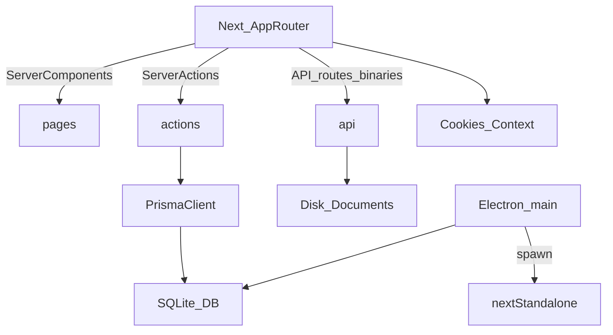

## TL;DR (objectif produit)
Ma Compta Simplifié est une app **offline-friendly** (web + desktop Electron) de **comptabilité en partie double** pour associations.

- **Unité de travail**: une **association**, puis un **exercice** (OUVERT/CLOTURE).
- **Cœur quotidien**: saisie d’écritures (modes rapide/avancé) → grand livre → justificatifs.
- **Docs**: pièces justificatives par exercice, liaison a posteriori à des lignes comptables, export ZIP.
- **Desktop**: Electron embarque Next.js standalone + SQLite local dans le dossier utilisateur.

## Stack technique (résumé)
- **Frontend/SSR**: Next.js App Router (`next` 16.2.4) + React 19 (`src/app/*`).
- **Data**: Prisma 7 (`prisma` CLI + client généré dans `src/generated/prisma`, imports app via `@/lib/db`) + SQLite (`DATABASE_URL=file:...`, adaptateur `@prisma/adapter-better-sqlite3`).
- **Desktop**: Electron + `electron-builder` (packaging multi-OS) (`desktop/*`).
- **Exports**: ZIP via `archiver`, PDF via `jspdf`/`jspdf-autotable`, CSV via route dédiée.

## Architecture (flux)

## Fonctionnel (features)
### Associations
- CRUD + statut **clôturée**.
- Une association possède 0..n exercices.

### Exercices (OUVERT/CLOTURE)
- Création d’exercice (dates début/fin) avec duplication du plan comptable “global” dans `Compte`.
- Certaines opérations sont bloquées si exercice/asso clôturé (garde-fous côté serveur).

### Journaux / Écritures / Lignes
- Journaux standards: `AC`, `BQ`, `CA`, `OD`, `VE` (voir `src/app/saisie/page.tsx`).
- Écriture = date + libellé + journal + exercice + lignes (débit/crédit).
- Montants stockés en **centimes (Int)** (affichage en euros côté UI).
- Numérotation pièce par exercice+journal via `JournalSequence` (champ `numeroPiece`/`pieceSequence` sur `Ecriture`).

### Saisie (quotidien)
- Page: `src/app/saisie/page.tsx` + form client `src/app/saisie/SaisieForm.tsx`.
- Deux modes:
  - **RAPIDE**: dépenses/recettes/virements (auto-journal selon type).
  - **AVANCE**: multi-lignes, validation d’équilibre.
- Pièce justificative optionnelle à la saisie (upload + lien auto aux lignes créées).

### Grand livre + export
- Page: `src/app/ecritures/page.tsx`.
- Export CSV: `src/app/api/exercices/[id]/grand-livre.csv/route.ts`.

### Documents justificatifs
- Page liste: `src/app/documents/page.tsx` (par exercice).
- Upload: `src/app/documents/UploadDocumentForm.tsx` → server action `src/actions/documentActions.ts`.
- Download fichier: `src/app/api/documents/[id]/download/route.ts`.
- ZIP exercice: `src/app/api/exercices/[id]/documents.zip/route.ts`.
- Liaison a posteriori: `src/app/documents/[id]/lier/*` (multi-select + recherche).

### Bilan / Résultat
- Page: `src/app/bilan/page.tsx` + export PDF via `src/app/bilan/DownloadPdfButton.tsx`.

## Modèle de données (Prisma / SQLite)
Source de vérité: `prisma/schema.prisma`.

- **Association** 1—n **Exercice**
- **Exercice** 1—n **Compte**
- **Exercice** 1—n **Ecriture** 1—n **LigneEcriture**
- **Exercice** 1—n **Document**
- **Document** n—n **LigneEcriture** via **DocumentLigneEcriture**
- **AuditEvent**: journalisation minimale (data stockée en string JSON).
- **JournalSequence**: compteur séquentiel (par exercice+journal).

Champs sensibles/conventions:
- **Centimes**: `LigneEcriture.montantDebit/montantCredit` = Int (centimes).
- **Numérotation**: `Ecriture.numeroPiece` (ex: `AC-000001`), `Ecriture.pieceSequence`.
- **Documents**: `Document.relativePath` + `storedName` pour le stockage disque.

## Contexte (sélection association/exercice)
Contexte via cookies (Server Components):
- `src/lib/associationContext.ts`: cookie `currentAssociationId`
- `src/lib/exerciceContext.ts`: cookie `currentExerciceId`

Le TopBar gère l’UI de sélection (voir `src/components/TopBar.tsx` + `src/components/TopBarClient.tsx`).

## Stockage fichiers (pièces justificatives)
Implémentation: `src/lib/documentsStorage.ts`.

- Base: `process.cwd()/data/uploads/...` (ignoré Git via `.gitignore`).
- Nommage: `<timestampUTC>_<originalNameSlug>__<shortId>.<ext>` (ext dérivée du MIME).
- Validation: PDF + images (JPG/PNG/WEBP), max 20 Mo.

## Desktop (Electron) & DB “prod”
Entrée: `desktop/electron/main.ts`.

- En dev: DB partagée avec le repo (`prisma/dev.db`).
- En prod packagé:
  - DB utilisateur: `app.getPath('userData')/app.db`
  - initialisation: copie de `prisma/template.db` vers `userData/app.db` si absent
  - logs: `userData/desktop.log`
- Packaging: `desktop/electron-builder.json` + `next.config.ts` (`output: "standalone"`).
- Génération template DB: `scripts/build-template-db.mjs` (utilise `prisma migrate deploy` sur `prisma/template.db`).

## Commandes (dev/build)
Voir `package.json`:
- **Web dev**: `npm run dev` (fait `prisma generate && next dev`)
- **Build web**: `npm run build`
- **Desktop dev**: `npm run desktop:dev`
- **Desktop dist**: `npm run desktop:dist`

Prisma (config : `prisma.config.ts` à la racine) :
- `npx prisma generate` (obligatoire après changement de schema ; `postinstall` le fait aussi)
- `npx prisma migrate dev` (dev) puis **`npx prisma db seed`** si besoin des journaux standard
- `npx prisma migrate deploy` (template DB, prod, Electron)

## Conventions UI (à respecter)
Règles repo: `AGENTS.md`.

- **Suppression**: toujours via modal de confirmation (pas `window.confirm`).
- **Listes**: actions en **icônes** avec `title` + `aria-label`.
- **Modal**: utiliser `src/components/ConfirmDialog.tsx`.

## Où modifier quoi (map rapide)
- **Dashboard**: `src/app/page.tsx` + `src/components/PaymentMethodsEvolutionChart.tsx`
- **Sélection contexte**: `src/components/TopBar*` + `src/lib/*Context.ts`
- **Saisie**: `src/app/saisie/page.tsx`, `src/app/saisie/SaisieForm.tsx`, `src/actions/ecritureActions.ts`
- **Grand livre**: `src/app/ecritures/page.tsx`, export `src/app/api/exercices/[id]/grand-livre.csv/route.ts`
- **Docs**: `src/app/documents/*`, actions `src/actions/documentActions.ts`, stockage `src/lib/documentsStorage.ts`
- **Bilan/PDF**: `src/app/bilan/*`
- **Electron runtime**: `desktop/electron/main.ts`, build `desktop/electron-builder.json`, scripts `scripts/*`

## Pièges connus / debug
- **Erreur prod Next masquée (digest)**: en prod, le message est omis. Sur Electron, regarder `desktop.log` dans `userData`.
- **Modèle Prisma “invisible”**: si `prisma.<model>` est `undefined`, relancer `prisma generate` et redémarrer le serveur.
- **Hydration mismatch**: éviter `new Date()` dans le rendu initial des Client Components sans snapshot serveur (passer `nowIso` depuis le serveur).

## Historique / décisions (archives)
- **Documents justificatifs** (espace documentaire par exercice + ZIP + liaison multi-lignes + upload sans liaison obligatoire) [Documents justificatifs](82e5c56a-554d-41e3-b701-1a10d2eb488e)
- **Branding/UI** (couleurs primaire/succès alignées au logo, travail sur sidebar/icons/tooltips) [Branding & sidebar](b502f6e6-9fb2-413c-92a0-c2da93d167dd)

